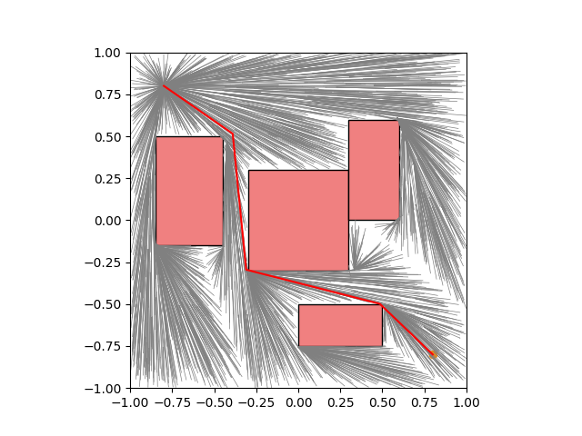
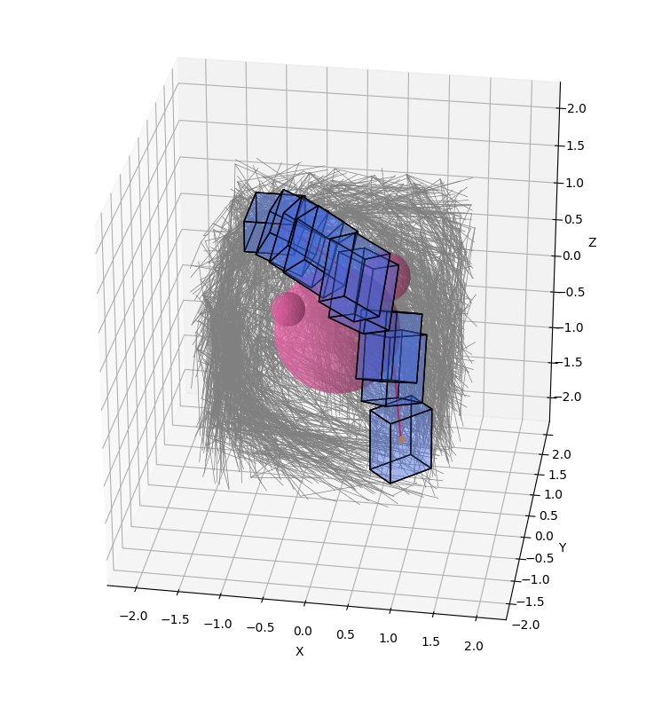

# OMPLチュートリアル(Python ver.)
## Install

```bash
git clone https://github.com/Ry0/ompl_python_tutorial
sudo docker build -t ompl .
sudo docker run ompl
```

DockerfileではOMPLをpyenvで作成したPython環境でも使用できるようにしている。
仮想環境名は`ompl`としている。今後システムに入っているPythonバージョンとは異なるバージョンでOMPLを使いたくなったときの対策。※ /usr/bin/python3がシステムのPython。

VSCodeを使っている場合は、Reopen in Containerをクリックすれば、勝手にビルドが始まる。


## tutorial_1
動作テスト。  
https://ompl.kavrakilab.org/python.html

```bash
cd ompl_python_tutorial
pyenv local ompl
python sample/tutorial_1.py
```

## tutorial_2
`tutorial_1`にPlannerの設定を追加しただけ。  
`RRTConnect`、`RRTStar`、`PRM`など。

```python
# set planner
planner = og.RRTConnect(ss.getSpaceInformation())
ss.setPlanner(planner)
```

## tutorial_3
StateSpaceを`SE2StateSpace`から`RealVectorStateSpace`に変更したもの。
関節軸空間とかで探索したいときのためのサンプル。  
次元を2とすれば、`SE2StateSpace`と同等。

## tutorial_4
2次元の探索テスト。実際に障害物を入れて動作を確認している。



## tutorial_5
3次元の探索テスト。3次元の姿勢も含む。

