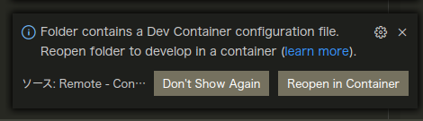

# OMPLチュートリアル(Python ver.)
## Install

```bash
git clone https://github.com/Ry0/ompl_python_tutorial
sudo docker build -t ompl .
sudo docker run ompl
```

DockerfileではOMPLをpyenvで作成したPython環境でも使用できるようにしている。
仮想環境名は`ompl`としている。今後システムに入っているPythonバージョンとは異なるバージョンでOMPLを使いたくなったときの対策。※ /usr/bin/python3がシステムのPython。

VSCodeを使っている場合は、Reopen in Containerをクリックすれば、勝手にビルドが始まる（結構時間がかかる）。



## 動作テスト

```bash
cd ompl_python_tutorial
pyenv local ompl
python sample/tutorial_1.py
```